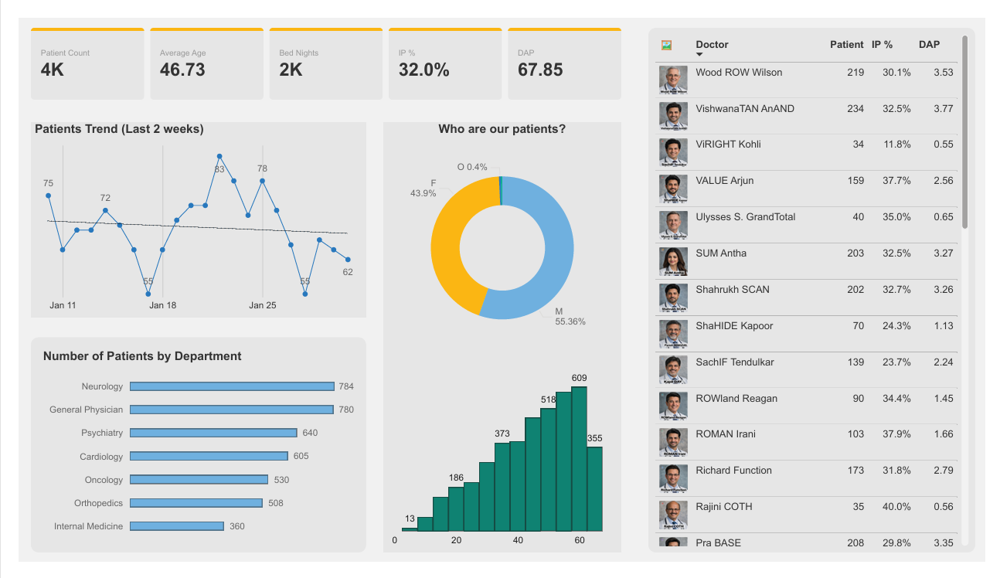

# Awesome Clinic Hospital Report

## A Screenshot of the Hospital Report

### Sample File:

[Download the ready to use blank file](Awesome_Clinic_Data_Report.pbix)
The file is fully self-contained. 

### Quick Insights:

Click this links to view the quick insights for the Awesome Clinic Data Report
[Quick Insights](https://app.powerbi.com/groups/me/insights/c515c674-fb33-49ab-befd-d4000093b2b6?insightsSource=Desktop&experience=power-bi)

# 📂Overview

This project analyzes operational performance at Awesome Clinic using Power BI. The goal was to evaluate patient volume, demographic trends, departmental demand, referral behavior, and inpatient resource utilization over a two-month period.

Rather than focusing only on descriptive metrics, this analysis translates raw healthcare data into operational decisions. The report highlights workload distribution, referral variability, bed utilization patterns, and short-term demand fluctuations to identify areas for process optimization and resource planning.

The dataset was modeled and transformed using Power Query, and performance measures were built using DAX to support interactive KPI tracking and operational insights. It utilizes data from a <a href="https://www.youtube.com/live/bokH-VVB1fs?si=G-klniNYtpAMzWJt" rel="nofollow">live Power BI masterclass tutorial by Chandoo on YouTube</a>

🎯 Business Objective

The primary objective of this analysis was to answer:

- How stable is patient demand?
- Are departments evenly utilized?
- Are referral practices consistent across doctors?
- Is inpatient capacity being used efficiently?
The report is designed to support operational leadership in improving workload balance, referral consistency, and resource forecasting.

# 🧰Tools Used for the Analysis
This analysis leverages **Power BI** to examine Awesome Clinic's data.

# 🦵Steps Taken for the Analysis
Sveral key steps were taken for the performance of this analysis:

1. Extracting, loading, and transforming the various datasets.
2. Data modeling and application of a few cleanup steps using the Power Query Editor
3. Application of practical DAX measures
4. Creating interactive visuals and KPI cards
5. Building the report/dashboard

# 📊The Analysis

Key findings for the patient and operational performance analysis are shown below:

* A total of 4,000 patients were attended.
* Male patients account for 55.36% of visits.
* Neurology and General Physician departments have the highest patient volumes.
* Referral (IP %) averages 32%, with noticeable variation across doctors.
* Recent patient trends show mild volatility with a slight downward movement at the end of the two-week period.

Operationally, the clinic is performing strongly in volume, but referral variation and departmental load balancing present opportunities for optimization.

### 1. Dataset Overview

Key Metrics:

* Total Patients: 4,000
* Average Age: 46.73 years
* Bed Nights: 2,000
* IP % (Inpatient Rate): 32.0%
* DAP (Daily Average Patients): 67.85

### 2. Patient Trend Analysis (Last 2 Weeks)

The patient trend graph shows daily fluctuations between approximately 55 and 83 patients.

Observations:

* Peak attendance reached 83 patients.
* Lowest recorded value was 55.
* The trendline indicates a slight downward movement toward the end of the period.

Implication:
The clinic is experiencing short-term variability. This may reflect:

* Weekly demand cycles
* Daily average patients
* Referral volume changes

Monitoring this trend over a longer time horizon would confirm whether this is normal fluctuation or an emerging decline.

### 3. Patient Demographics

Gender Distribution:

* Male: 55.36%
* Female: 43.9%
* Other: 0.4%

Observation:
The clinic serves slightly more male patients. The distribution is relatively balanced, suggesting broad demographic coverage.

Recommendation:
Marketing and outreach campaigns could be designed to strengthen engagement in the underrepresented segment.

### 4. Departmental Analysis

Number of Patients by Department:

* Neurology – 784
* General Physician – 780
* Psychiatry – 640
* Cardiology – 605
* Oncology – 530
* Orthopedics – 508
* Internal Medicine – 360

Key Insight:
Neurology and General Physician departments handle the largest patient loads. Internal Medicine has the lowest volume.

Implications:

* High-volume departments may face capacity strain.
* Resource allocation (staffing, equipment, scheduling) should prioritize Neurology and General Medicine.
* Internal Medicine may require referral review or visibility assessment.

### 5. Age Distribution

The histogram indicates:

* Majority of patients fall between ages 30–60.
* Strong concentration in mid-age and older adult segments.

Implication:
The clinic primarily serves a middle-aged and aging population, which aligns with higher chronic condition prevalence (cardiology, neurology, oncology).

Operational Consideration:
Preventive care programs targeting this demographic could improve long-term outcomes and reduce inpatient burden.

### 6. Daily Average Patient Analysis

Daily level metrics include:

* Patient Count
* IP % (Referral/Inpatient percentage)
* DAP score

Observations:

* IP % varies significantly across doctors (ranging from ~11% to 40%).
* Some days have high patient volumes with moderate referral rates.
* Others have high referral percentages despite lower patient counts.

Implications:

* Variability suggests differences in case complexity or referral behavior.
* Standardizing referral guidelines may improve consistency.
* Further review may identify best practices among high-performing doctors.

### 7. Operational Efficiency Indicators

Bed Nights: 2,000
With 4,000 patients and 32% IP rate, inpatient resource utilization appears substantial.

This indicates:

* Strong inpatient activity.
* Potential need to forecast bed capacity during peak weeks.

DAP Score (67.85):
If DAP reflects performance or productivity, the clinic is operating at a relatively strong efficiency level, but interpretation depends on internal benchmarks.

# 💉Recommendations

1. Balance Department Workload
   Increase support for Neurology and General Physician departments to avoid burnout and bottlenecks.

2. Standardize Referral Practices
   Investigate doctor-level IP % variation and develop structured referral guidelines.

3. Monitor Demand Trends
   Track patient trends over a 3–6 month window to identify true growth or decline patterns.

4. Strengthen Preventive Programs
   Focus on middle-aged demographic groups to reduce inpatient dependency over time.

5. Resource Forecasting
   Develop a simple predictive model for bed usage based on weekly trends and referral percentages.

# 🔍 Key Takeaways

This project strengthened my ability to analyze healthcare operations data while improving my dashboard design and performance interpretation skills. Three key lessons stood out:

* **Operational Insight Over Raw Numbers:** Metrics like IP %, Bed Nights, and department volume only become valuable when translated into clear operational implications and decisions.

* **Performance Variability Signals Opportunity:** Differences in referral rates and doctor productivity highlight areas where process standardization and resource optimization can improve efficiency.

* **Clear Visualization Drives Action:** Presenting trends and KPIs in a structured, easy-to-read dashboard is essential for enabling faster, data-driven decision-making.

# 🏁Conclusion

Awesome Clinic demonstrates strong patient volume and consistent inpatient activity. Demand is concentrated in specific departments and within middle-aged demographics. While overall performance is stable, referral variation and workload distribution represent areas for strategic improvement.